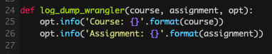

dotfiles
======
My workflow mainly consists of vim and tmux. Here's some of the decisions I've made to improve that workflow.

vim
---
Some plugins to improve vim workflow
- [vim-plug](https://github.com/junegunn/vim-plug): a simple plugin manager
- [vim-airline](https://github.com/vim-airline/vim-airline): a lightweight statusline
- [vim-fugitive](https://github.com/tpope/vim-fugitive): run git commands within vim!
- [vim-commentary](https://github.com/tpope/vim-commentary): easily comment out lines

I've always really enjoyed the Monokai theme from Sublime. Here's what I used to improve syntax highlighting and colors:
- [vim-sublime-monokai](https://github.com/ErichDonGubler/vim-sublime-monokai): started here and tweaked color choices for C types, functions, and literals. (I'll probably edit this more as I start to develop more in other languages)
- [vim-cpp-modern](https://github.com/bfrg/vim-cpp-modern): wanted vim to highlight more! Slightly tweaked what/how tokens were colored
- [vim-python](https://github.com/vim-python/python-syntax): improved python highlighting
- [rippl.vim](https://github.com/al3623/rippl.vim): highlighter my friend made for our [language](https://github.com/al3623/rippl)

tmux
----
My goals here were to improve appearance and copy/paste functionality. I'll admit that I should really learn how to effectively use vim panes but in the meantime...
- [edkolev/tmuxline.vim](https://github.com/edkolev/tmuxline.vim): a lightweight tmux statusline that comes with vim-airline integration
- [roxma/vim-tmux-clipboard](https://github.com/roxma/vim-tmux-clipboard): effectively allows for easy copy/paste between vim/tmux and vim buffers in different tmux panes

screenshots
-----------
- **C** – some code from the linux kernel  

- **Python** - some code from [cs3157/boatswain](https://github.com/cs3157/boatswain)  

todo
----
-  I am currently setting symlinks manually for the dotfiles. Maybe I'll look into GNU Stow... 
-  Add git shorthands to `.gitconfig`

friends
-------
Here's a list of dotfiles resources that I used for inspiration :^)
- https://dotfiles.github.io
- https://vimawesome.com/
- [gtr/dotfiles](https://github.com/gtr/dotfiles)
- [j-hui/pokerus](https://github.com/j-hui/pokerus)
- [kzh/dotfiles](https://github.com/kzh/dotfiles)
